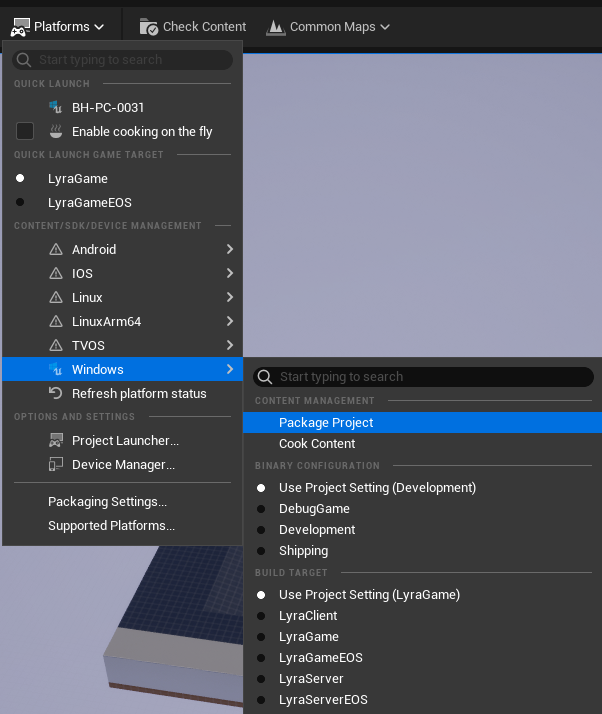

Lyra Sample Game
===

Content Information
----
To run this sample you will need the following version of Unreal Engine from the Epic Games Launcher:
	- Unreal Engine 5.4.4

When downloading the Lyra Sample from BULKHEAD's git, in order to reduce git space the content folders are not included.

Therefore, you will need to download the Lyra Game Sample Content from the Unreal Marketplace through the Epic Games Launcher.

Follow the following steps to do this:
 1. Ensure you have 5.4.4 from the Epic Games Launcher
 2. Follow the guide at [Unreal Engine Lyra documentation](https://dev.epicgames.com/documentation/en-us/unreal-engine/lyra-sample-game-in-unreal-engine?application_version=5.4) to download the Lyra Sample.
 3. Create a Lyra Sample Game Project for UE 5.4.4.
 4. Once you have created a Lyra Sample Game Project, copy the Content folder from the sample into the BULKHEAD version from git.
 5. Open the code solution in your IDE of choice.
	 - (Preferred) For Rider, Open the .uproject directly.
	 - For Visual Studio, right click the .uproject and select "Generate Visual Studio project files".
 6. Build & Run.
 7. The Editor should open and you should be good to go!

Demo Rules
----
 - You should choose one of the following to focus on implementing:
   - A new movement feature.
   - A new gameplay system.
   - An entirely new type of weapon.
 - You should use C++ as much as possible.
 - Complex code should be commented where appropriate.
 - Blueprints usage is acceptable for trival setup work that would be cumbersome via C++ (UI/Widgets/GameMode etc).
 - Make sure you test in both PIE (Play in Editor) & Packaged.

Submitting Your Demo
----
In order to submit your demo, you will need to upload a packaged version of your game to an online hosting service such as OneDrive, Google Drive, DropBox etc.

To create a package follow these steps:
 1. Click **Platforms** > **Windows** > **Package Project** (See below image)
 2. Choose a suitable location on disk.
 3. Wait for the package process to complete (this may take a while...)
 4. Zip up the "**Windows**" folder in the location you chose above.
 5. Upload the zipped package to a cloud service of your choice and contact BULKHEAD Recruitment with a link to this.

Additional Information
----
See the [Unreal Engine README](../../../README.md) at the root of the repository for [Licensing](../../../README.md#licensing) and [Contributing](../../../README.md#contributions) information.